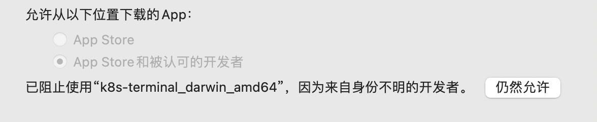

kubernetes dashboard "替代品"

在terminal发起http请求查看kubernetes相关的信息

> 注意 
>
> 1. 本程序以查看当前namespace、deployment、pod等信息为主， 面向业务开发人员，主要原因是权限受限。如果是运维人员绕行即可
> 2. 当前只是使用与token登录方法，暂不支持kubeConfig方式 

#### 1. 安装

下载二进制安装包

以MacOS为例

```shell script
chmod a+x k8s-terminal_darwin_amd64
./k8s-terminal_darwin_amd64 install  # 默认安装到 /usr/local/bin/ 目录下
```

或者 下载源码直接make编译

```shell script
cd k8s-terminal
make
```

#### 2. 使用

##### 2.1 初始化

```shell script
k8s-terminal init \ 
    --ip <k8s dashboard web ip>  \
    --port <k8s dashboard web port>  \
    --token <k8s dashboard login with token>
    --force # 如果别你存在配置文件会进行备份后覆盖修改
````

##### 2.2 查看当前namespace

查看全部namesapce

````shell script
k8s-terminal namespace 
k8s-terminal n
k8s-terminal n -h 
````

##### 2.3 查看deployment 

功能描述: 查看namespace下的某个deployment的具体信息, 使用场景例如查看某个deployment的端口，部署信息等

```shell script
k8s-terminal deployment --ns <namespace> -n <deployment name>
k8s-terminal deployment --deployment-namespace <namespace> --deployment-name <deployment name>
```

##### 2.4 查看实时日志信息

````shell script
k8s-terminal pod --ns <namespace> -n <pod name>
k8s-terminal pod --pod-namespace <namespace> --pod-name <pod name>
k8s-terminal pod --ns <namespace> -n <pod name> -e
````

##### 2.5 更多

查看 secret 中的内容

更多的使用细节查看帮助文档

````shell script
k8s-terminal -h
k8s-terminal <command> -h
````

#### 常见问题

1. MacOS 安装需要授权



2. 在执行安装命令后，找不到`k8s-terminal`

因为默认安装 `/usr/local/bin`, 当前的shell找到
需要将`/usr/local/bin`目录导入到当前系统变量中

bash修改`~/.bashrc`， zsh 修改`~/.zshrc`

追加

```shell script
export PATH=$PATH:/usr/local/bin:.
```

生效
```shell script
source ~/.zshrc 

or

source ~/.bashrc
```

3. 使用中记不住定义的名字

内置help

```shell script
k8s-terminal -h
k8s-terminal n -h
k8s-terminal d -h
k8s-terminal p -h
k8s-terminal init -h
....
```

    NAME:
       k8s-terminal - k8s集群，主要替代kubernetes dashboard token登录，对deployment, pod, service, namespace, configMap的查看

    USAGE:
       k8s-terminal [global options] command [command options] [arguments...]

    VERSION:
       v0.0.4/2022-01-14 16:38:10/ece25ecf195f140044aef3449109fcabfec5e7ec https://github.com/clibing/k8s-terminal

    AUTHOR:
       clibing <wmsjhappy@gmail.com>

    COMMANDS:
       namespace, n   获取当前kubernetes集群的namespace
       deployment, d  Deployment相关操作, 选择对应的deployment部署信息和service对应的端口
       pod, p         POD相关操作, 选择对应的Pod,查看POD的配置，支持实时查看Log
       install, i     安装
       init           环境初始化
       secret,        查看对应的secret详细配置内容
       help, h        Shows a list of commands or help for one command

    GLOBAL OPTIONS:
       --help, -h     show help (default: false)
       --version, -v  print the version (default: false)

    COPYRIGHT:
       Copyright (c) 2022 clibing, All rights reserved.


#### 附录

1. bubbletea


